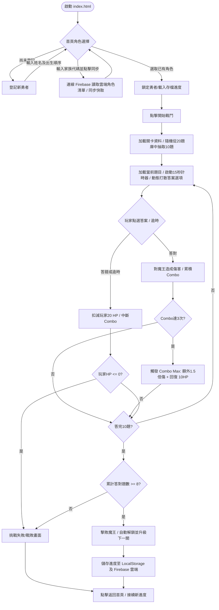

# 數學大魔王挑戰 - 遊戲工作流程與使用指南
(Math Boss Battle - Workflow & User Guide)

本指南旨在幫助玩家、老師或開發人員快速了解遊戲的設計架構、核心規則、運行流程。

---

## 🎨 遊戲核心工作流程 (Mermaid 流程圖)

以下是遊戲從啟動、角色建立、戰鬥到判定勝負的完整生命週期流程：

---

## 🎮 核心玩法與機制

### 1. 關卡與主題難度設定
遊戲預設設有 **5 大關卡**，題目難度循序漸進：
- **第一關：朱孟玲（女）** - 基礎乘除法（國小二至三年級）。
- **第二關：朱佩玲（女）** - 三位數乘法、有餘數的除法（國小三至四年級）。
- **第三關：朱雁玲（女）** - 因數與倍數、等值分數、小數互換（國小四至五年級）。
- **第四關：溫化有（女）** - 分數乘除法、長方體體積與容量（國小五年級）。
- **第五關：朱振興（男 - 終極魔王）** - 質因數分解、圓周長與圓面積、速率換算、比與比值（國小六年級）。

### 2. 隨機出題機制
- 每一關的資料庫內建有 **20 題的題目池**。
- 每次戰鬥啟動時，系統會**隨機打亂**並**挑選其中 10 題**供玩家作答。即使重新挑戰同一個關卡，題目也會有所不同。

### 3. 隨機選項打散與正確答案分配
- 為了避免正確答案集中在特定按鈕（例如 B 或 C），每道題目在加載時，其 4 個選項按鈕都會被動態隨機打亂（Shuffled）。
- 系統會自動在記憶體中重新計算並鎖定正確答案的新索引，確保答案在 A、B、C、D 之間具有完全均等的隨機分布機率（各 25%），完全打破正確答案的規律性。

### 4. 戰鬥數值與勝負規則
- **玩家血量 (HP)**：最大值 100。答錯一題或時間逾時會被扣減 20 點 HP。血量歸 0 則立即戰敗。
- **連擊系統 (Combo)**：連續答對 3 題會觸發 **Combo Max**，該題對魔王造成的傷害增加 1.5 倍，且為玩家回復 10 點 HP。
- **倒數計時**：每題有 15 秒作答時間。最後 4 秒計時條會轉為紅色警告。
- **通關條件**：答完 10 題後，玩家除了必須存活，還必須**答對 8 題以上**才算成功通關。

---

## 💾 技術與進度儲存機制 (LocalStorage / Firebase Firestore)

為了方便在不同時間接續遊玩，本遊戲採用 **雙重混合儲存技術**：

### 1. 單機本機儲存 (LocalStorage)
- 用於儲存玩家的進度快取，即使在沒有網路的環境下也能運作。
- **`math_boss_profiles`**：儲存玩家角色清單及歷史成績。
- **`math_boss_active_profile_id`**：記錄當前選取的玩家 ID。
- **`math_boss_group_code`**：記錄當前設定的雲端同步家族代碼。

### 2. Firebase Firestore 雲端同步
- 當在 [app.js](file:///c:/Users/chuch/OneDrive/Desktop/Agent/app.js) 的 `firebaseConfig` 填入您的 Google Firebase 金鑰，且在網頁輸入了 **「雲端同步代碼」** 時：
  - 新增角色、更新解鎖進度及作答紀錄會同步寫入雲端的 Firestore 資料庫中。
  - 路徑結構：`/groups/{家族代碼}/profiles/{角色ID}`。
  - 在任何新裝置上輸入同一個「家族代碼」並點擊「同步資料」，即可立刻載入相同的角色名單與關卡進度。

---

## 🕹️ 如何本地使用本遊戲
1. 下載並將所有檔案（`index.html`, `index.css`, `app.js` 及 `assets` 資料夾）存放在同一個目錄中。
2. 雙擊 **[index.html](file:///c:/Users/chuch/OneDrive/Desktop/Agent/index.html)** 檔案即可在任何瀏覽器中打開。
3. 建立角色，點擊「開始戰鬥」，即可開始挑戰！

---

## 🌐 如何將遊戲部署至網路上（免費線上遊玩）

本遊戲是純前端的靜態網頁（無後端資料庫），因此非常適合放在免費的網頁託管服務上。以下提供兩種最簡單的免費部署方式：

### 方法一：Vercel 拖放部署（最簡單，30 秒完成）
1. 註冊並登入 [Vercel 官網](https://vercel.com)（可以使用 GitHub 帳號或電子信箱註冊）。
2. 進入 Vercel Dashboard，點擊右上角的 **「Add New」** -> **「Project」**。
3. 滾動到頁面最下方，找到 **「Browse Templates or Deploy a static directory (Drag & Drop)」** 區塊。
4. 直接將電腦桌面的整個 `Agent` 資料夾拖曳到該區塊中。
5. 部署完成後，Vercel 會自動為您生成一個免費的網址（例如：`https://agent-math-boss.vercel.app`），將網址分享出去，其他人就能在手機或平板上線上遊玩了！

### 方法二：GitHub Pages（適合長期維護與程式碼管理）
1. 註冊並登入 [GitHub 官網](https://github.com)。
2. 點擊新建儲存庫（New Repository），命名為 `math-boss-game`，並設定為 Public。
3. 在儲存庫頁面，上傳您 `Agent` 資料夾內的所有檔案（包括 `index.html`、`index.css`、`app.js`、與整個 `assets` 目錄）。
4. 上傳完成後，點擊該儲存庫頂部的 **「Settings」**（設定）標籤頁。
5. 在左側選單中找到 **「Pages」** 項目。
6. 在 **Build and deployment** 下的 **Branch** 選擇 `main`（或 `master`）分支與 `/ (root)` 資料夾，然後點擊 **Save**。
7. 等待約 1 到 2 分鐘，重新整理頁面後，頂部會出現專屬的免費線上網址：`https://你的GitHub帳號.github.io/math-boss-game/`。
